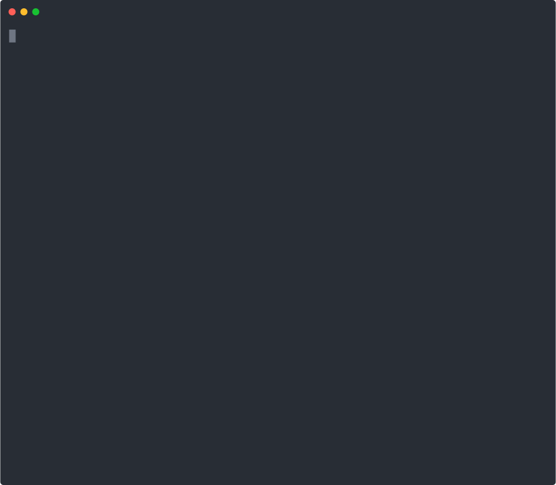

# MCP Shield

[](https://opensource.org/licenses/MIT)
[](https://nodejs.org/)
[](https://www.typescriptlang.org/)
[](https://agentgateway.dev)

**SSL Labs for MCP servers — score, secure, and govern your MCP deployment in one command.**

*Built for the [MCP & AI Agents Hackathon 2026](https://aihackathon.dev) — Secure & Govern MCP track.*

MCP servers typically run as direct stdio processes with zero security. MCP Shield scans your existing IDE configuration, generates a production-ready [agentgateway](https://github.com/agentgateway/agentgateway) setup with JWT authentication, rate limiting, and audit logging, and federates all your MCP servers behind a single secure endpoint.

<p align="center">
  
</p>

## The Problem

Most MCP deployments look like this:

```
[MCP Client (any IDE)]
     |        |        |
[filesystem] [memory] [github]   ← No auth, no limits, no logging
```

- **No authentication** — anyone with endpoint access can call any tool
- **No rate limiting** — a rogue agent can exhaust resources
- **No audit trail** — no visibility into what tools are being called
- **No federation** — each server is a separate connection to manage

## The Solution

```
[MCP Client (any IDE)]
          |
    [agentgateway]  ← JWT auth + rate limiting + audit logging
     /    |    \
[filesystem] [memory] [github]
```

MCP Shield generates all the configuration automatically.

## Quick Start

```bash
# Install
npm install -g mcp-shield

# Score your current security posture
mcp-shield score

# Scan your MCP setup
mcp-shield scan

# Generate a secured configuration
mcp-shield secure

# Publish to agentregistry
mcp-shield publish

# Start the gateway
mcp-shield start

# Verify security is working
mcp-shield verify
```

## Commands

### `mcp-shield score`

Assess the security posture of your MCP deployment with an A-F letter grade across 9 dimensions.

```bash
mcp-shield score
mcp-shield score -f my-config.json
```

**Scoring dimensions** (100 points total):
| Dimension | Weight | What it checks |
|-----------|--------|----------------|
| Authentication | 25 | JWT/OAuth token validation |
| Rate Limiting | 15 | Token bucket protection |
| Audit Logging | 15 | Request/response logging |
| Endpoint Federation | 10 | Single gateway endpoint |
| Transport Security | 10 | TLS/stdio isolation |
| Input Validation | 10 | Tool argument sanitization |
| CORS Policy | 5 | Cross-origin controls |
| OAuth Discovery | 5 | .well-known metadata |
| Server Isolation | 5 | Per-server RBAC |

### `mcp-shield scan`

Discovers MCP server configurations from your IDE config files (Cursor, VS Code, and others).

```bash
# Auto-detect
mcp-shield scan

# Specify a config file
mcp-shield scan -f ~/.config/claude/claude_desktop_config.json
```

### `mcp-shield secure`

Generates an agentgateway configuration with enterprise-grade security policies.

```bash
# Basic (JWT auth, strict mode)
mcp-shield secure

# With rate limiting
mcp-shield secure --rate-limit 60

# Custom port and auth mode
mcp-shield secure --port 8080 --auth optional

# Specify config file and output directory
mcp-shield secure -f my-config.json -o ./my-gateway
```

**Options:**
- `--auth <mode>` — `strict` (default), `optional`, or `permissive`
- `--rate-limit <rpm>` — Requests per minute limit
- `--port <port>` — Gateway port (default: 3000)
- `-o, --output <dir>` — Output directory (default: `./mcp-shield-output`)

### `mcp-shield start`

Launches agentgateway with the generated configuration.

```bash
mcp-shield start
mcp-shield start --gateway-bin /path/to/agentgateway
```

### `mcp-shield verify`

Tests that the gateway is properly secured.

```bash
mcp-shield verify
mcp-shield verify --url http://localhost:8080
```

## What Gets Generated

```
mcp-shield-output/
├── gateway-config.yaml          # agentgateway configuration
├── claude_desktop_config.json   # Updated client config (points to gateway)
└── keys/
    ├── pub-key                  # JWKS public key (for agentgateway)
    └── priv-key.pem             # Private key (for signing tokens)
```

## Security Features

| Feature | Description |
|---------|-------------|
| **JWT Authentication** | OAuth2/JWT token validation on all MCP endpoints |
| **Rate Limiting** | Token bucket rate limiting per endpoint |
| **CORS** | Configurable cross-origin resource sharing |
| **Federation** | Multiple MCP servers behind a single secure endpoint |
| **Per-Server Isolation** | Individual endpoints for each MCP server (`/mcp/<name>`) |
| **OAuth Discovery** | Standard `/.well-known/oauth-protected-resource` metadata |

## Supported Config Formats

- **Claude Desktop** — `claude_desktop_config.json`
- **Cursor** — `.cursor/mcp.json`
- **VS Code** — `.vscode/settings.json`
- **Custom** — Any JSON with `servers` array

## Requirements

- [Node.js](https://nodejs.org/) 18+
- [agentgateway](https://github.com/agentgateway/agentgateway/releases) binary

## Built With

- [agentgateway](https://agentgateway.dev) — AI-native data plane for agent connectivity
- [TypeScript](https://www.typescriptlang.org/) — Type-safe CLI implementation
- [Commander.js](https://github.com/tj/commander.js) — CLI framework

## License

MIT
